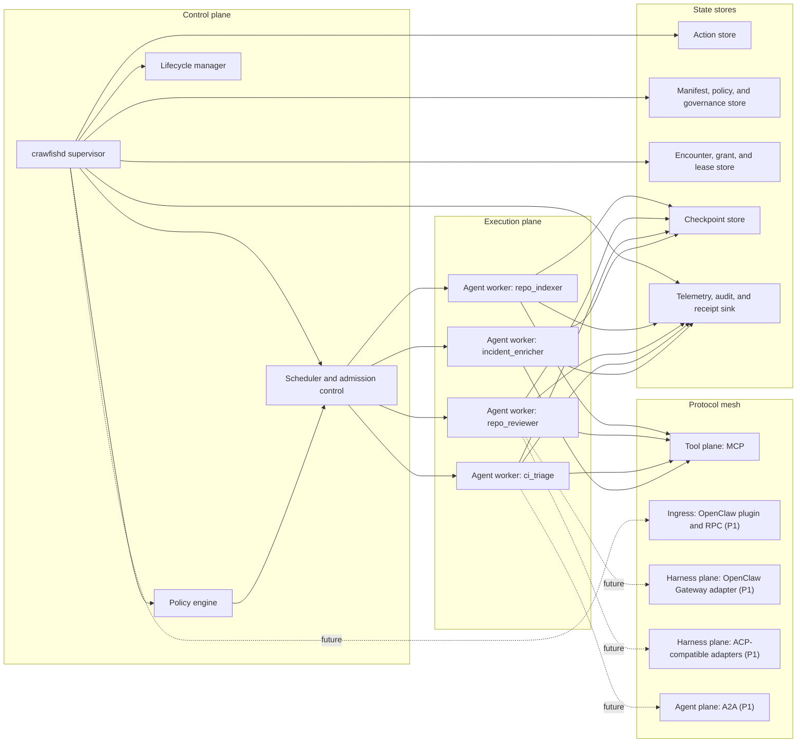
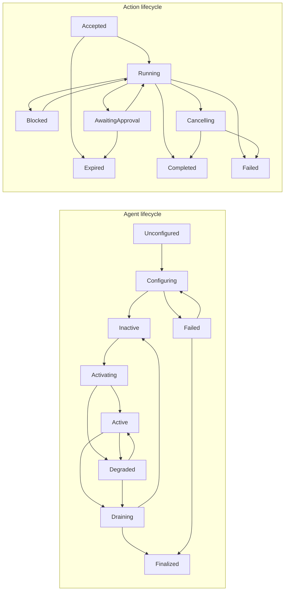

# Crawfish

> Lifecycle-managed agent runtime and control plane for always-on production systems.

Crawfish is a general-purpose agent runtime for teams that need agents to run under explicit operational constraints: lifecycle, deadlines, budgets, approvals, tool scopes, checkpointing, recovery, and continuity during serious outages. It sits between lightweight agent SDKs and durable workflow engines.

Philosophically, Crawfish treats agents as bounded software workers, not mystical autonomous entities. The runtime's job is not to maximize autonomy at all costs. Its job is to maximize useful agency under explicit control.

In a world where specialized harnesses and agent gateways such as [OpenClaw](https://docs.openclaw.ai/concepts/agent-loop), [Codex](https://openai.com/codex/), [Claude Code](https://docs.anthropic.com/en/docs/claude-code/overview), [Gemini CLI](https://github.com/google-gemini/gemini-cli), and ACP-compatible clients keep multiplying, Crawfish is not trying to be one more harness. It is the continuity and governance layer above many harnesses.

When agents roam across owners, laptops, and networks, governance is not optional. The same machine is already a frontier: different agents may belong to different humans, teams, or contexts and should not silently share workspace, memory, secrets, or mutating authority just because they happen to run side by side.

This repository is now **Rust-first for implementation** and **Markdown-first for product and architecture specs**. The Markdown files in [`docs/spec/`](docs/spec/) remain the design source of truth. The Cargo workspace under [`crates/`](crates/) is the implementation source of truth. Generated exports live in [`docs/exports/`](docs/exports/), and historical materials live in [`docs/archive/`](docs/archive/).

To regenerate the consolidated DOCX export from Markdown, run `python3 scripts/export_docset.py`.

To compile and test the Rust workspace, run `cargo test --workspace`.

## Why Crawfish

- **Harnesses are plentiful; operability is scarce.** Crawfish exists to make many harnesses, gateways, and agent runtimes behave like one governable system.
- **Governance is not optional.** When agents from different owners or trust domains meet, Crawfish treats that as a governed encounter, not an implicit collaboration.
- **Managed lifecycle instead of ad hoc loops.** Agents are supervised resources with desired state, observed state, health checks, drain behavior, and degraded modes.
- **Action-based durable execution instead of fire-and-forget calls.** Long-running work is modeled as a first-class action with feedback, cancellation, checkpointing, and resumability.
- **Execution contracts instead of policy hidden in prompts.** Delivery, cost, safety, quality, and recovery rules are compiled and enforced by the runtime.
- **Three-plane interoperability instead of one transport assumption.** Crawfish uses MCP for tools, OpenClaw Gateway and ACP-compatible integrations for specialized harnesses, and A2A for remote agent delegation.
- **Continuity above the model layer instead of provider lock-in.** When models, harnesses, or networks are impaired, Crawfish contracts safely into deterministic fallbacks, queueing, cached reads, or human handoff.

Compared with [LangGraph](https://docs.langchain.com/oss/python/langgraph/overview), [OpenAI Agents SDK](https://openai.github.io/openai-agents-python/), and [Temporal Workflows](https://docs.temporal.io/workflows), Crawfish is centered on operating agent fleets under policy and failure pressure, not only composing agent logic or durable control flow. Compared with [OpenClaw](https://docs.openclaw.ai/concepts/agent-loop), Crawfish is the continuity control plane, not the interactive agent loop or gateway surface.

## System



## Lifecycle



## Hero Demo

The first public story is a small engineering and operations fleet running under one supervisor:

- `repo_indexer` keeps repository structure and ownership context warm.
- `repo_reviewer` reviews pull requests and produces structured findings.
- `ci_triage` classifies failed CI runs and suggests next actions.
- `incident_enricher` gathers logs, traces, and likely blast radius for production alerts.

The demo shows five things at once:

1. Dependency-aware activation and drain order.
2. Degraded behavior when `repo_indexer` or an MCP dependency is impaired.
3. Approval-gated mutating actions for workspace or ticket updates.
4. Restart recovery from the last durable checkpoint.
5. Continuity behavior when every external model route is unavailable.

The same demo should also prove a harder claim: if every external model route is unavailable, the fleet does not simply disappear. It keeps the control plane alive, continues deterministic work where possible, queues or hands off the rest, and makes the contraction explicit.

Future versions of the same demo should also show bidirectional OpenClaw interop and Ralph-style verified coding actions: OpenClaw can submit work into Crawfish as an external control surface, while selected coding actions such as `coding.patch.plan` route out through the OpenClaw Gateway agent loop and complete only after deterministic verification passes.

That same future demo should also show a same-device foreign-owner encounter: a roaming external agent can request access to a local capability, but it must pass encounter policy, receive explicit consent, and execute only through a revocable capability lease.

## v0.1 Scope

The alpha scope is intentionally narrow:

- `crawfishd` supervisor daemon
- lifecycle manager
- action execution
- execution contract v1
- MCP integration
- checkpoint and resume
- observability baseline
- security baseline

Continuity baseline is delivered through these same P0 systems. It is not a separate product surface so much as the discipline with which lifecycle, recovery, and inspection behave under serious outage.

OpenClaw interoperability, `ACP`, and `A2A` remain important parts of the product story, but they are intentionally deferred until after the lifecycle, contract, and recovery model is proven in P0.

## Current Alpha Slice

The current Rust alpha already covers one runnable Hero P0 slice:

- `repo.index` scans a local workspace and emits `repo_index.json`.
- `repo.review` runs deterministic review checks and reuses or bootstraps the latest repo index.
- `ci.triage` classifies CI failures from direct logs or from an SSE MCP tool route.
- `inspect` surfaces artifact refs, checkpoint refs, recovery stage, continuity mode, encounter metadata, and external refs.
- restart recovery requeues `running` actions and resumes deterministic work from checkpoint metadata.

The first external tool transport implemented in code is `MCP over SSE`. `repo_reviewer` remains deterministic-first, while `ci_triage` can fetch remote log material through MCP and then complete the actual classification locally.

## Quickstart

Start with the design docs:

1. [`docs/spec/vision.md`](docs/spec/vision.md) for category, positioning, and competitive wedge.
2. [`docs/spec/architecture.md`](docs/spec/architecture.md) for public primitives, state machines, and runtime model.
3. [`docs/spec/v0.1-plan.md`](docs/spec/v0.1-plan.md) for alpha scope, milestones, and acceptance criteria.
4. [`docs/spec/glossary.md`](docs/spec/glossary.md) for canonical terminology.
5. [`docs/README.md`](docs/README.md) for repository documentation policy and export locations.

Then use the Rust workspace:

```bash
cargo test --workspace
cargo run -p crawfish-cli --bin crawfish -- init ./sandbox
cd sandbox
cargo run -p crawfish-cli --bin crawfish -- run &
CRAWFISH_PID=$!
sleep 1
cargo run -p crawfish-cli --bin crawfish -- status --json
cargo run -p crawfish-cli --bin crawfish -- action submit \
  --target-agent repo_reviewer \
  --capability repo.review \
  --goal "review pull request" \
  --inputs-json "{\"workspace_root\":\"$(pwd)\",\"changed_files\":[\"src/lib.rs\"]}" \
  --json
cargo run -p crawfish-cli --bin crawfish -- action submit \
  --target-agent ci_triage \
  --capability ci.triage \
  --goal "triage local logs" \
  --inputs-json "{\"log_text\":\"error: test failed, to rerun pass \`cargo test\`\"}" \
  --json
cargo run -p crawfish-cli --bin crawfish -- inspect <action-id> --json
kill $CRAWFISH_PID
```

For a full sample configuration, start from [`examples/hero-fleet/Crawfish.toml`](examples/hero-fleet/Crawfish.toml) and the agent manifests under [`examples/hero-fleet/agents/`](examples/hero-fleet/agents/).
