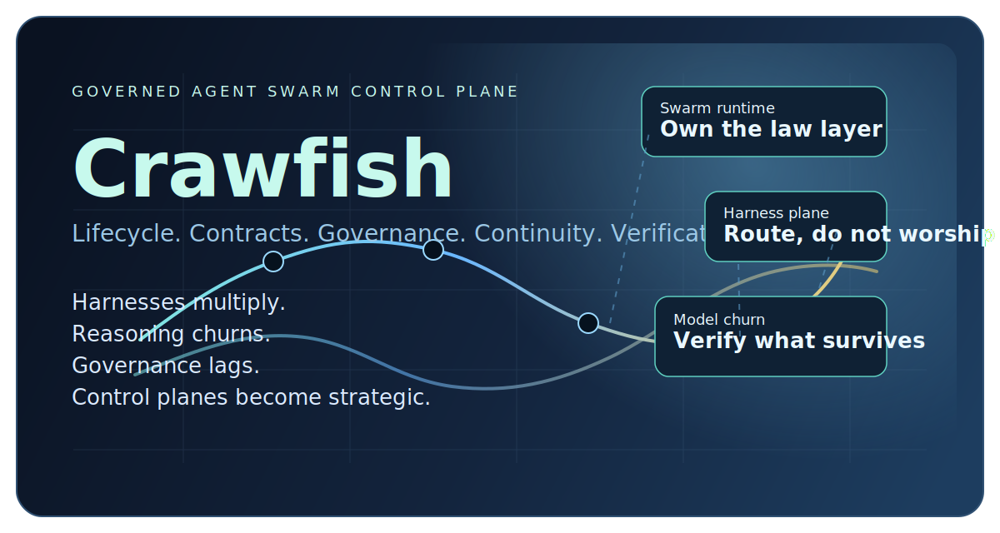

# Crawfish

> **Crawfish is the control plane for governed agent swarms.**
>
> **Harnesses are abundant. Constitutions are not enough. Evaluation is how a swarm learns without becoming opaque.**

Harnesses are abundant. Cognition is volatile. Governance is lagging.  
Crawfish exists for the layer above all of that: lifecycle, contracts, continuity, verification, doctrine, and multi-owner control.

Crawfish is a **lifecycle-managed runtime** for agent swarms that need to survive real operating conditions: budgets, approvals, outages, degraded dependencies, foreign-owner encounters, and model churn. It is not another assistant shell, not another graph toy, and not a harness trying to pretend it is the whole system.

## Why Now

The agent stack is changing faster than the rules around it.

- Specialized harnesses keep multiplying: OpenClaw, Codex, Claude Code, Gemini CLI, ACP-compatible clients, and more.
- The quality of reasoning is improving, but it is also unstable across vendors, models, and release cycles.
- Governance and operational practice still trail capability growth.
- Multi-owner agent encounters are no longer theoretical. They already happen on the same laptop.

Most teams are still driving by the rear-view mirror, in the sense described by Notion's ["Steam, Steel, and Infinite Minds"](https://www.notion.com/blog/steam-steel-and-infinite-minds-ai): building with yesterday's application assumptions while swarm-scale agency is arriving with today's tools.

Crawfish is built for that mismatch.

## Why Constitutions Are Not Enough

High-level principles matter. They are still not governance.

Anthropic's [Claude's Constitution](https://www.anthropic.com/constitution) is a strong example of rule-guided model behavior. Anthropic's earlier [Constitutional AI](https://www.anthropic.com/research/constitutional-ai-harmlessness-from-ai-feedback/) work made the same point at training time: written principles can shape behavior. But a constitution does not enforce itself once agents begin roaming across workspaces, owners, harnesses, and execution surfaces.

The frontier problem is different:

- a principle can say "do not overreach"
- the runtime still needs a `pre_dispatch` checkpoint
- the system still needs evidence that the checkpoint ran
- the operator still needs escalation when the check cannot be enforced

That is why Crawfish now treats governance as runtime structure, not policy prose:

- doctrine packs
- jurisdiction classes
- oversight checkpoints
- enforcement records
- policy incidents

If a rule exists but no checkpoint, no evidence, and no escalation path exists, the swarm is still operating in a wild-west mode.

## Why Swarm, Not Assistant

An assistant is usually imagined as a single interface.  
A swarm is a governed system of bounded workers, harness-backed execution surfaces, tools, policies, and owners.

Crawfish treats the future as swarm-shaped:

- many agents, not one
- many harnesses, not one
- many owners and trust domains, not one
- many continuity states, not a binary up/down illusion

`Swarm` here does **not** imply shared trust, shared memory, or ambient context sharing. It means a governed collection of agents and harness-backed workers under one control plane.

## Why Swarm, Not Role-Split Multi-Agent

Much earlier "multi-agent" work was often about splitting roles inside one application, not governing real encounters across owners, harnesses, and trust boundaries.

- LangChain's multi-agent docs frame the problem primarily as [context engineering](https://docs.langchain.com/oss/python/langchain/multi-agent): deciding what information each sub-agent should see and how much context to pass.
- OpenAI's Agents SDK frames multi-agent coordination around [handoffs](https://openai.github.io/openai-agents-python/handoffs/) and shared run [context](https://openai.github.io/openai-agents-python/context/) inside one agentic application.
- AutoGen's Swarm docs explicitly describe agents that [share the same message context](https://microsoft.github.io/autogen/0.7.3/user-guide/agentchat-user-guide/swarm.html).

Those patterns are useful. They are not the same as the environment Crawfish is built for.

Crawfish targets the point where "many" stops meaning "more prompt wrappers inside one app" and starts meaning:

- many bounded workers, not one conversation tree
- many owners, not one ambient authority
- many harness surfaces, not one centrally managed loop
- many real encounter boundaries, not only context partitioning

That is why Crawfish needs doctrine, checkpoints, leases, evidence, evaluation, and escalation. Context split is coordination. Swarm governance is a different systems problem.

## Why Crawfish Is Not Another Harness

Harnesses are execution surfaces. Crawfish governs them.

- OpenClaw is an interactive gateway-native harness surface.
- Codex, Claude Code, Gemini CLI, and future ACP-compatible adapters are specialized general-purpose harnesses.
- MCP tools are tool-plane integrations.
- A2A is the first real remote-agent plane in the current design, using [Agent Cards and task-based delegation](https://github.com/a2aproject/A2A) in the shape introduced by Google's ["A2A: A New Era of Agent Interoperability"](https://developers.googleblog.com/a2a-a-new-era-of-agent-interoperability/).

Crawfish does not compete by being one more reasoning loop. It competes by making many volatile reasoning loops behave like **one inspectable system**.

## Why Remote Agents Are Not Just Another Harness

Remote agents are not only remote processes. They are separate authorities.

A harness crossing changes the execution surface. A remote-agent crossing changes the governance problem. A2A's [Agent Card](https://github.com/a2aproject/A2A) model and task lifecycle make that explicit: the runtime is delegating work to another agent system, not just spawning another wrapper on the same machine.

That is why Crawfish treats remote delegation differently:

- harnesses are selected execution surfaces
- remote agents are treaty-governed delegation targets
- doctrine still applies, but treaties decide whether cross-system delegation is allowed at all
- remote task lineage, remote principal identity, and delegation receipts must remain inspectable

That is why the project is **Rust-first, not Rust-only**:

- `crates/` is the implementation spine for the runtime, control plane, storage, and native outbound adapters.
- `integrations/` is the edge zone for isolated bridge packages where a non-Rust implementation is pragmatic.
- The current example is [`integrations/openclaw-inbound/`](integrations/openclaw-inbound/), a thin TypeScript ingress bridge. The policy engine, lifecycle authority, storage, and runtime decisions remain in Rust.

## What The Control Plane Enforces

Crawfish is opinionated about what must survive model churn.

- **Lifecycle**: agents are supervised resources with desired state, health, drain behavior, degraded profiles, and recovery rules.
- **Contracts**: deadlines, budgets, approval rules, mutation mode, and fallback policy are compiled into runtime behavior.
- **Governance**: same-device foreign-owner encounters are classified, constrained, auditable, and revocable.
- **Continuity**: when a model route or harness disappears, the swarm contracts into deterministic work, store-and-forward, or handoff instead of vanishing behind retries.
- **Verification**: success is not whatever a model claims. Verification-sensitive work runs under deterministic checks and bounded retry budgets.
- **Inspection**: actions expose phase, artifacts, checkpoints, external refs, event lineage, governance metadata, and operator-readable failure codes.

## What Runs Today

The current alpha is not a mock architecture. It runs.

### Read-Only Swarm Path

- `repo.index` emits `repo_index.json`
- `repo.review` emits `review_findings.json` and `review_summary.md`
- `ci.triage` emits `ci_triage.json` and `ci_triage_summary.md`
- `incident.enrich` emits `incident_enrichment.json` and `incident_summary.md`

### Approval-Gated Mutation Path

- `workspace.patch.apply` performs local deterministic edits
- mutation stays approval-gated
- grants, leases, revocation, workspace locks, and audit receipts are enforced by the runtime

### Harness Paths

- **Local-first harness routing**: `task.plan` now prefers local Claude Code and Codex wrappers before any remote route
- **A2A outbound remote delegation**: `task.plan` can delegate to a remote agent over [A2A](https://github.com/a2aproject/A2A) when a treaty pack allows it
- **OpenClaw inbound**: a thin Gateway RPC bridge can submit and inspect Crawfish work without becoming a second policy engine
- **OpenClaw outbound**: `task.plan` can still route out through OpenClaw as a proposal-only execution surface when local harnesses are absent or unsuitable
- **Deterministic fallback**: if no approved harness route is available, `task.plan` can degrade into local planning when the compiled contract allows it
- **Verified execution strategy**: local wrappers, OpenClaw, and deterministic fallback are all forced through the same deterministic verifier

## Verified Execution Strategies

`verify_loop` is the first implemented execution strategy beyond `single_pass`.

For `task.plan`, Crawfish now does this:

1. Select an execution surface.
2. Run one proposal attempt.
3. Deterministically verify the result.
4. Feed structured verification failures back into the next attempt.
5. Stop on success, human handoff, or budget exhaustion.

Today that surface can be:

- a local Claude Code process
- a local Codex process
- an OpenClaw outbound run
- a deterministic fallback planner

This is where the project starts to look beyond the current generation of agent demos.  
Reasoning quality will keep changing. Verification and control have to outlive that churn.

## Evaluation Spine

Tracing alone is not enough. Evaluation alone is not enough. A control plane needs both.

LangSmith provides a useful reference shape here through its [observability concepts](https://docs.langchain.com/langsmith/observability-concepts), [annotation queues](https://docs.langchain.com/langsmith/annotation-queues), and [automation rules](https://docs.langchain.com/langsmith/set-up-automation-rules): traces, datasets, evaluators, review, and alerts belong to one operational loop. Crawfish does not copy LangSmith's product. It lifts that shape into swarm runtime infrastructure.

The runtime now builds an **evaluation spine**:

- `trace -> scorecard -> review queue -> alert -> dataset -> replay`

That spine is attached to real action execution:

- `task.plan`
- `repo.review`
- `incident.enrich`

The point is not to build a hosted dashboard first. The point is to make swarms inspectable and corrigible before the UI arrives.

Observability is the rear-view mirror. Evaluation is the learning loop.

In Crawfish:

- `TraceBundle` captures inputs, executor lineage, artifacts, events, external refs, and verification outputs
- `EvaluationRecord` turns deterministic checks into durable quality evidence
- `ReviewQueueItem` escalates work that should not quietly auto-complete
- `FeedbackNote` lets operator judgment flow back into future iterations without rewriting history
- `AlertRule` turns governance or evaluation failures into visible operator signals
- `DatasetCase` freezes completed actions into replayable evaluation datasets with doctrine and jurisdiction metadata
- `ExperimentRun` replays those cases against one executor surface so the swarm can learn without polluting production review queues

## Philosophy

The forward-looking product philosophy lives in [`docs/spec/philosophy.md`](docs/spec/philosophy.md).

The short version:

- build for swarm-age governance, not single-agent demos
- harnesses are replaceable, control planes are strategic
- reasoning is volatile; contracts and verification must survive model churn
- institutions lag capability growth, as argued in Notion's ["Steam, Steel, and Infinite Minds"](https://www.notion.com/blog/steam-steel-and-infinite-minds-ai); runtime guardrails cannot
- constitutions do not enforce themselves
- constitutions guide models; institutions govern swarms
- frontier enforcement gaps are runtime failures, not merely policy failures
- evaluation is how a swarm learns without becoming opaque
- design for future multi-owner encounters, not yesterday's app sandbox

The supporting spec set lives in:

- [`docs/spec/philosophy.md`](docs/spec/philosophy.md)
- [`docs/spec/vision.md`](docs/spec/vision.md)
- [`docs/spec/architecture.md`](docs/spec/architecture.md)
- [`docs/spec/v0.1-plan.md`](docs/spec/v0.1-plan.md)
- [`docs/spec/glossary.md`](docs/spec/glossary.md)

## Quickstart

The reference example lives under [`examples/hero-swarm/`](examples/hero-swarm/).

```bash
cargo test --workspace
cargo run -p crawfish-cli --bin crawfish -- init ./sandbox
cp examples/hero-swarm/Crawfish.toml ./sandbox/Crawfish.toml
cp examples/hero-swarm/agents/*.toml ./sandbox/agents/
cd sandbox
cargo run -p crawfish-cli --bin crawfish -- run &
sleep 1

cargo run -p crawfish-cli --bin crawfish -- action submit \
  --target-agent task_planner \
  --capability task.plan \
  --goal "propose a task plan" \
  --caller-owner local-dev \
  --inputs-json '{
    "workspace_root": ".",
    "objective": "Plan a safe rollout for repo indexing validation",
    "context_files": ["src/lib.rs"],
    "desired_outputs": ["rollout checklist"]
  }' \
  --json

cargo run -p crawfish-cli --bin crawfish -- action events <action-id> --json
cargo run -p crawfish-cli --bin crawfish -- action trace <action-id> --json
cargo run -p crawfish-cli --bin crawfish -- action evals <action-id> --json
cargo run -p crawfish-cli --bin crawfish -- review list --json
cargo run -p crawfish-cli --bin crawfish -- eval dataset list --json
cargo run -p crawfish-cli --bin crawfish -- eval run task_plan_dataset --executor deterministic --json
cargo run -p crawfish-cli --bin crawfish -- alert list --json
```

For the full reference walkthrough, run [`examples/hero-swarm/demo.sh`](examples/hero-swarm/demo.sh).

If `claude` or `codex` is installed locally, `task_planner` will prefer those harnesses first. If neither local wrapper is available, Crawfish now tries treaty-governed A2A remote delegation before OpenClaw, then falls back to deterministic planning when the contract allows it.

## Public Status

Crawfish is public and maintained seriously, but it is still **alpha**.

| Surface | Status |
| --- | --- |
| CLI | public, unstable |
| `Crawfish.toml` and manifests | public, unstable |
| local UDS HTTP API | public, unstable |
| Rust workspace crates | public, unstable |

Current support baseline:

- version posture: `0.x` / `alpha`
- implementation posture: Rust-first, not Rust-only
- supported runtime environments: macOS and Linux
- supported MCP transport in the current codebase: SSE only

Breaking alpha changes are allowed, but they must ship with:

- a changelog entry in [`docs/project/CHANGELOG.md`](docs/project/CHANGELOG.md)
- README or spec updates
- a migration note when the break is user-visible

Primary alpha config direction:

- `quality.evaluation_profile` is the primary evaluation selector
- `quality.evaluation_hook` still parses during alpha, but it is deprecated and only normalized for legacy built-ins

Project maintenance policy lives in:

- [`docs/project/CHANGELOG.md`](docs/project/CHANGELOG.md)
- [`.github/CONTRIBUTING.md`](.github/CONTRIBUTING.md)
- [`.github/SECURITY.md`](.github/SECURITY.md)
- [`.github/SUPPORT.md`](.github/SUPPORT.md)
