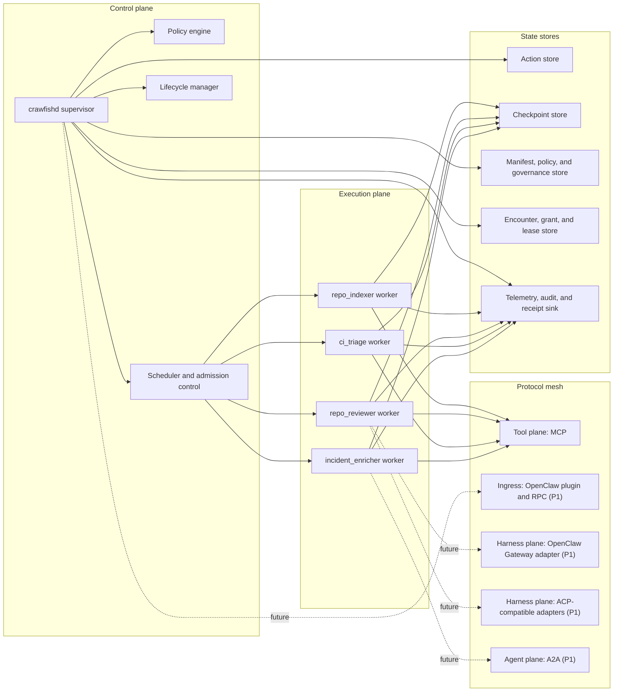
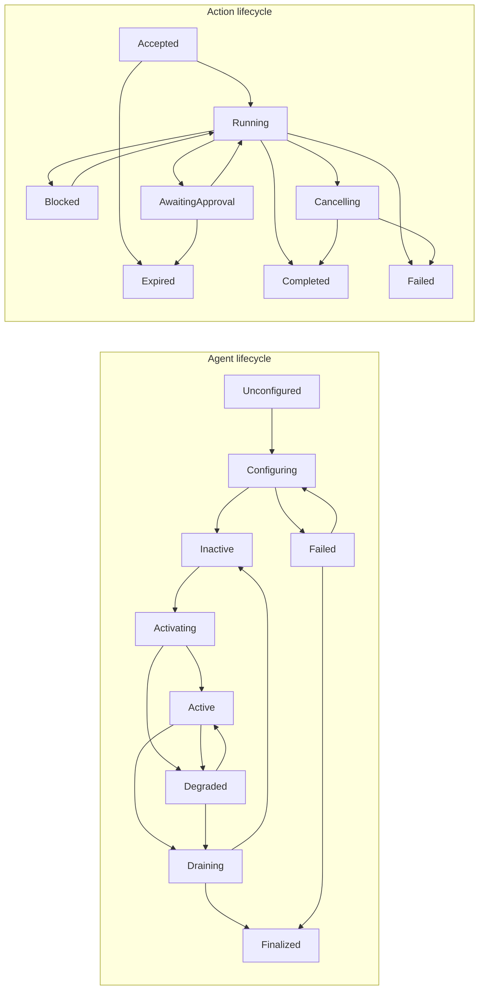

# Crawfish Vision

Canonical terminology is defined in [`glossary.md`](glossary.md).
Forward-looking design principles are defined in [`philosophy.md`](philosophy.md).

## Product Thesis

Crawfish is a **general-purpose agent runtime and control plane** for teams that need always-on agent systems to operate safely under real production constraints. It is not a single-purpose coding agent, a no-code graph builder, or a generic workflow engine.

The product wedge is simple:

- most frameworks help you build agent logic
- Crawfish helps you **operate agent systems**

That means lifecycle, degradation, budgets, approvals, checkpointing, and recovery are part of the product surface, not left to application glue.

## Product Philosophy

Crawfish is built around eight philosophical commitments:

- **Operate agents, do not merely invoke them.** The product's center of gravity is runtime control, not prompt assembly.
- **Agency must be bounded.** Useful agents are allowed to act, but only through explicit capability, contract, and policy boundaries.
- **Specialization beats monolithic omniscience.** A general runtime should compose many specialized tools and harnesses rather than pretending one universal agent is always best.
- **Harnesses are plentiful; operability is scarce.** The strategic gap is not one more reasoning surface. It is the runtime layer that can govern many reasoning surfaces together.
- **Reasoning is volatile; verification must survive model churn.** The runtime should trust deterministic checks and contracts more than any temporary model quality spike.
- **Governance is not optional.** When agents can roam, persist, and encounter each other across owners and contexts, the runtime must supply law-like boundaries, not only scheduling logic.
- **Interoperability should be layered.** Tool interoperability, harness interoperability, and remote-agent interoperability are different problems and should not be collapsed into one transport abstraction.
- **Graceful degradation is better than brittle autonomy.** A production system should shrink safely under pressure before it fails hard.
- **Continuity matters more than peak cleverness.** The product is judged by the safest useful work it can keep doing when the reasoning layer is impaired, not only by the best-case intelligence of a healthy model route.
- **Institutions lag capability growth.** Runtime guardrails, encounter policy, and revocation semantics should arrive before the ecosystem feels fully comfortable with them, in the broader sense argued by Notion's ["Steam, Steel, and Infinite Minds"](https://www.notion.com/blog/steam-steel-and-infinite-minds-ai).
- **Constitutions are necessary but insufficient.** High-level rules matter, but runtime checkpoints and evidence are what turn them into governance.
- **Evaluation is a control-plane primitive.** Traces, scorecards, review queues, alerts, datasets, and replay loops should be runtime objects, not only analytics afterthoughts.

## Agent Philosophy

In Crawfish, an agent is not defined by personality or chat behavior. It is defined by role, capability, constraints, memory scope, and operational behavior.

This leads to three design consequences:

- an agent is a bounded software worker, not a sovereign autonomous actor
- autonomy is graduated and inspectable, not binary and mystical
- external harnesses are first-class collaborators when they are more specialized than the local runtime

The corollary is important: Crawfish should never assume the most capable LLM or harness is always available. A real agent runtime needs a philosophy for what remains useful when reasoning power collapses.

The second corollary is equally important: cooperation is not the default. An agent may be powerful, but it still belongs to some owner, trust domain, and data context. Those boundaries must stay explicit when agents encounter one another.

## Category Definition

Crawfish defines a category between agent SDKs and durable workflow engines: **lifecycle-managed agent runtime**.

This category matters because production agents are not just request handlers and not just workflows. They are:

- stateful and long-running
- tool-using and policy-sensitive
- failure-prone and budget-sensitive
- distributed across agents, tools, and stores
- expected to pause, recover, drain, and resume cleanly

## Positioning

For platform engineers and AI product teams running high-value agent systems, Crawfish is the runtime that adds lifecycle control, contract enforcement, and operational resilience. Unlike agent SDKs, it does not stop at model and tool orchestration. Unlike workflow engines, it is model-native, protocol-native, and policy-aware.

## Protocol Planes

Crawfish should talk about interoperability in three planes:

- **Tool plane:** MCP for tools and services.
- **Harness plane:** OpenClaw Gateway and ACP-compatible harnesses for specialized execution surfaces, including planning, research, operations, investigation, and coding agents.
- **Agent plane:** A2A for remote agent delegation across system boundaries.

This framing is more accurate than treating all integrations as generic subprocesses. It also matches the actual product problem: tools, harnesses, and remote agents have different semantics, risk envelopes, and scheduling implications. The [A2A project](https://github.com/a2aproject/A2A) and Google's ["A2A: A New Era of Agent Interoperability"](https://developers.googleblog.com/a2a-a-new-era-of-agent-interoperability/) are the key reference anchors for the remote-agent plane.

## Why Governance Becomes Core When Agents Roam

The first generation of multi-agent systems mostly treated agents as task-level helpers. Multiple agents often meant little more than role separation or context isolation inside one application. LangChain's multi-agent docs explicitly frame this around [context engineering](https://docs.langchain.com/oss/python/langchain/multi-agent), OpenAI's Agents SDK frames it around [handoffs](https://openai.github.io/openai-agents-python/handoffs/) and shared run [context](https://openai.github.io/openai-agents-python/context/), and AutoGen Swarm describes agents that [share the same message context](https://microsoft.github.io/autogen/0.7.3/user-guide/agentchat-user-guide/swarm.html).

That world is ending.

If each person, team, and product can have many always-on agents, the real problem changes:

- agents belong to different owners
- agents carry different personal, team, or product context
- agents may encounter each other on the same device before they ever meet on the open internet
- agents may request access to capabilities or data they do not own

At that point, governance is not a secondary security feature. It becomes part of the runtime's core job.

The distinction matters:

- old multi-agent often meant context-managed sub-agents under one application authority
- Crawfish targets true swarm governance across owners, trust domains, and harness surfaces
- remote delegation is governed separately from harness selection, because a remote agent is another authority boundary rather than just another execution wrapper

## Sovereignty Before Coordination

Crawfish should start from a sovereignty-first worldview.

That means:

- no ambient trust
- cooperation is leased, not implied
- data follows sovereignty
- every encounter is governable

In practice, this means Crawfish should default to isolation and explicit authorization, not optimistic collaboration. Coordination still matters, but it happens inside a legal envelope of consent, lease, revocation, and audit.

## Same Machine Is Already A Frontier

The same laptop is already a frontier environment.

A local coding agent, a personal research agent, an enterprise support agent, and a roaming OpenClaw-connected agent may all share one machine while belonging to different owners or trust domains. They should not automatically share:

- workspace write access
- memory and context windows
- local secrets
- network egress rights
- mutating tool authority

This is why same-device governance should be treated as the first concrete enforcement target. If the model is coherent locally, it can later generalize to internet-scale federation.

## Why Crawfish Matters In A Harness-Rich World

The harness market is getting crowded, not simpler. Teams can already choose among specialized surfaces such as [OpenClaw](https://docs.openclaw.ai/concepts/agent-loop), [Codex](https://openai.com/codex/), [Claude Code](https://docs.anthropic.com/en/docs/claude-code/overview), [Gemini CLI](https://github.com/google-gemini/gemini-cli), and ACP-compatible clients such as [Copilot CLI](https://docs.github.com/en/copilot/concepts/agents/copilot-cli/about-copilot-cli).

That does not reduce the need for Crawfish. It increases it.

When harnesses proliferate, the system problem shifts upward:

- which execution surface should run a task under which contract
- how should a harness failure affect other agents in the swarm
- what work can continue without any model or remote harness at all
- when should the runtime repair, queue, escalate, or hand off instead of pretending the outage did not happen

Crawfish exists to answer those questions. It is not another reasoning surface. It is the layer that turns many volatile reasoning surfaces into one operable system.

## Why OpenClaw Makes Crawfish More Necessary, Not Less

[OpenClaw](https://docs.openclaw.ai/concepts/agent-loop) is strategically important because it is already building the right adjacent layer: interactive agent loops, Gateway transport, plugins, RPC adapters, and multi-channel entry points. Those are real adoption vectors.

That does not make Crawfish redundant. It sharpens the boundary.

OpenClaw is strong where a gateway and agent-loop platform should be strong:

- session and channel entry
- interactive agent execution
- plugin distribution and extension
- Gateway transport and RPC-style integration

Crawfish should be strong where a continuity control plane should be strong:

- lifecycle state and desired-state supervision
- execution contract compilation and enforcement
- continuity modes under route or network loss
- deterministic fallback, repair loops, and operator inspection
- swarm-wide policy and dependency semantics across many execution surfaces

The right relationship is bidirectional interoperability, not category confusion:

- OpenClaw can call Crawfish when a session needs durable, policy-bound swarm work.
- Crawfish can call OpenClaw when an action needs a specialized interactive or gateway-native agent surface.

## Why OpenClaw Looks Like The Wild West, And Why Crawfish Should Be The Law Layer

OpenClaw makes the modern agent environment easier to see clearly: powerful agents can move across local environments and network surfaces with real capability, but with relatively little built-in law.

That is not a criticism. It is a market signal.

The analogy is straightforward:

- OpenClaw is the roaming surface
- the agents are armed actors with meaningful capability
- the missing layer is not more firepower, but law

Crawfish should be that law layer:

- encounter classification instead of silent contact
- consent and grants instead of ambient access
- capability leases instead of permanent implied permission
- audit receipts and revocation instead of best-effort memory

## Why Constitutions Do Not Solve The Frontier Problem

[Claude's Constitution](https://www.anthropic.com/constitution) is an important example of rule-guided behavior. Anthropic's [Constitutional AI](https://www.anthropic.com/research/constitutional-ai-harmlessness-from-ai-feedback/) work showed how principles can steer a model. That is useful. It is still upstream of the runtime problem.

The frontier problem starts when many agents and harnesses begin operating across owners, workspaces, and execution surfaces:

- a constitution can influence what a model prefers
- it does not guarantee which checkpoint ran
- it does not produce durable evidence that a checkpoint ran
- it does not decide what to do when enforcement is missing

Crawfish therefore distinguishes:

- **model guidance**
  - principles that shape behavior
- **runtime governance**
  - jurisdiction
  - checkpoint enforcement
  - evidence
  - escalation

This is the product reason for a doctrine layer. Without it, systems can carry good principles and still behave like the frontier.

## Why Evaluation Spine Matters

The swarm also needs a quality memory, not just an event log.

[LangSmith](https://docs.langchain.com/langsmith/observability-concepts) is a useful reference because it shows the right operational shape: observability, evaluation, review, and automation should be connected. Its [annotation queues](https://docs.langchain.com/langsmith/annotation-queues) and [automation rules](https://docs.langchain.com/langsmith/set-up-automation-rules) are especially useful reference points. Crawfish should absorb that lesson at the control-plane layer rather than copying a hosted UI directly.

That means:

- every significant action should yield a trace bundle
- deterministic scorecards should produce durable evaluation records
- review queues should capture work that deserves operator attention
- feedback should flow into future iterations without erasing the historical record
- dataset capture should turn completed actions into replayable quality cases
- replay experiments should compare execution surfaces without generating normal production noise

In other words, evaluation is how a swarm learns without becoming opaque.

This is also where the distinction between constitutional guidance and runtime governance becomes concrete:

- Claude's Constitution can shape what a model prefers
- it cannot by itself produce trace bundles, scorecards, annotation queues, or replayable datasets
- it cannot tell an operator where doctrine failed to become enforcement

Crawfish exists to turn those missing institutional layers into runtime behavior.

## What Crawfish Is And Is Not

| Question | Crawfish | Not Crawfish |
| --- | --- | --- |
| Primary category | Agent runtime and control plane | No-code flow builder or generic DAG engine |
| Core value | Operational reliability, governance, policy control, resumable execution | Prompt experimentation surface |
| Primary workload | Always-on and long-running agent tasks with tools and approvals | Short-lived chat demos or benchmark-only flows |
| Interoperability stance | MCP for tools, OpenClaw and ACP for harnesses, A2A for remote agents | Single-vendor closed orchestration stack |
| Operational model | Desired-state supervision with health, drain, degrade, recover, and govern loops | Fire-and-forget imperative loops |

## System

## Lifecycle

## Market White Space

The crowded part of the market is agent authoring. The underbuilt part is **agent operations**.

| Existing category | What it does well | Where it stops short | Why Crawfish exists |
| --- | --- | --- | --- |
| Agent SDKs | tool calling, handoffs, tracing, fast onboarding | usually request-scoped, thin on lifecycle, budgets, health, and swarm operations | Crawfish adds a control plane around agent execution |
| Graph and workflow frameworks | persistence, branching, human-in-the-loop, orchestration composition | center the workflow graph rather than the ongoing life of supervised agents | Crawfish centers long-lived agents, dependency graphs, degraded mode, and runtime policy |
| Multi-agent chat frameworks | delegation patterns and event-driven prototyping | operational guarantees and approval semantics are often left to user code | Crawfish turns coordination into an operable system |
| Durable workflow engines | retries, timers, long-running state machines | not model-native and unaware of tool scopes, prompt context, or approval gates | Crawfish borrows durability ideas at the agent runtime layer |
| Agent gateways such as OpenClaw | channels, interactive sessions, plugins, RPC integration, agent loops | do not by themselves define lifecycle-managed swarm semantics, contract compilation, deterministic continuity, or repair policy | Crawfish complements the gateway with a runtime and control plane |
| Identity or access systems | principals, authn, authz, directory semantics | usually do not understand lifecycle-managed agents, capability leases, or encounter governance | Crawfish brings agent-native governance into runtime behavior |

## Why Not LangGraph + MCP + Temporal + Custom Supervisor?

Because that stack solves adjacent problems, not the full product problem.

| Piece | Official scope | What it still leaves you building |
| --- | --- | --- |
| [LangGraph](https://docs.langchain.com/oss/python/langgraph/overview) | durable agent workflows, persistence, human-in-the-loop, graph-based coordination | desired-state supervision, degradation profiles, policy compiler, swarm inspection, admission control |
| [MCP](https://modelcontextprotocol.io/docs/learn/architecture) | protocol for host-client-server tool integration | lifecycle, scheduling, checkpointing, approvals, budget enforcement, tool risk normalization |
| [Temporal](https://docs.temporal.io/workflows) | durable workflows with replay, timers, and recovery | model-native contracts, agent lifecycle, capability normalization, tool safety, policy-aware routing |
| [OpenClaw](https://docs.openclaw.ai/concepts/agent-loop) | interactive agent loop, Gateway, plugins, RPC adapters, multi-channel agent surface | swarm lifecycle, continuity semantics, deterministic fallback, repair loops, and cross-surface contract enforcement |
| custom supervisor | can patch missing operational pieces | every team rebuilds leases, failure taxonomies, inspection UX, policy precedence, and degraded behavior differently |

The wedge is not that Crawfish replaces these systems. The wedge is that Crawfish provides the missing runtime layer that lets them be combined coherently.

The same logic also explains where Crawfish sits relative to [OpenAI Agents SDK](https://openai.github.io/openai-agents-python/) and [AutoGen](https://microsoft.github.io/autogen/dev/): both are valuable agent-building frameworks, but neither is primarily a lifecycle-managed control plane for multi-agent swarm operations.

The same gap appears for specialized harnesses and gateways. [ACP](https://zed.dev/acp) and the [Agent Client Protocol specification](https://github.com/agentclientprotocol/agent-client-protocol) create a standard way for clients to talk to specialized agents and other harnesses. [OpenClaw's Gateway protocol and plugins](https://docs.openclaw.ai/gateway/protocol) create another practical integration surface for interactive agent loops. Those are valuable, but they still do not answer which harness should run, under which policy, with which fallback, or how its failure should affect the rest of a swarm. Crawfish exists above that layer.

The same gap appears inside a single model vendor's own philosophy. Rule-guided behavior can shape a harness, but it still leaves open the runtime questions of jurisdiction, checkpoint coverage, review queues, and operator alerts. Crawfish exists above that layer too.

## Target Users

| Role | Primary pain | Job to be done | Why Crawfish fits |
| --- | --- | --- | --- |
| Platform engineer or infra lead | agent systems are hard to supervise and hard to operate safely | deploy agent services with clear health, rollback, policy, and observability semantics | Crawfish provides lifecycle management, admission control, auditability, and recovery |
| AI product engineer | successful demos become unreliable when long-running tools and cost controls enter the picture | ship agent features that survive failures and stay within latency and budget limits | Crawfish turns model and tool calls into durable execution with contracts |
| Developer tools team | coding and repo agents need workspace safety, task isolation, and resumability | coordinate local or remote agents without uncontrolled edits or runaway loops | Crawfish adds approval gates, scoped tools, action semantics, and drain behavior |
| Security or governance lead | agents can cross owner or context boundaries too easily | define how agents encounter, lease capability, and leave evidence when they cross boundaries | Crawfish turns agent interaction into a governable runtime event |

## Beachhead And Hero Demo

The first public story should be a small engineering and operations swarm:

- `repo_indexer`
- `repo_reviewer`
- `ci_triage`
- `incident_enricher`

This hero demo is better than a generic chatbot because it makes the product's differentiators visible:

- dependency-aware activation
- approval-gated mutation
- degraded operation under dependency failure
- restart recovery from checkpoints

P1 extends the story in two concrete ways:

- an OpenClaw session or plugin can submit work into Crawfish for durable execution
- proposal-only actions such as `task.plan` can already route out to OpenClaw or another harness and run under a verified execution strategy when deterministic proof is required
- doctrine, checkpoint status, trace bundles, evaluations, and review queues make the enforcement gap visible instead of treating governance as a static config file
- a same-device foreign-owner agent encounter must pass encounter policy, explicit consent, and revocable leasing before it can cross local boundaries

## Product Principles

- Keep the agent loop simple. Operational complexity lives in the runtime.
- Prefer policies over prompt text. Budgets, approvals, and tool scopes must be machine-enforced.
- Prefer sovereign boundaries over ambient trust.
- Prefer graceful degradation over binary failure where safety allows it.
- Prefer verified loops over unverifiable success claims for verification-sensitive work.
- Prefer desired state over imperative orchestration.
- Stay protocol-native and vendor-neutral.
- Be developer-local first and production-ready second.
- Make observability part of the product surface.

## Why Continuity Matters

`Degraded` is necessary, but it is not the whole story.

The deeper product commitment is **continuity**: when the reasoning layer is under pressure, the runtime should preserve the safest useful subset of behavior instead of flipping directly from "fully agentic" to "dead."

That leads to a continuity ladder:

1. **Normal operation.** Full agentic execution under the compiled contract.
2. **Degraded operation.** The system is still agentic, but capability is contracted through named profiles such as `read_only`, `dependency_isolation`, or `budget_guard`.
3. **Deterministic continuity.** If all model or harness routes are unavailable, rule-based or traditional programmatic executors still perform the safe subset of work.
4. **Store-and-forward continuity.** If external dependencies such as network access are down, the runtime queues actions, keeps local evidence, and preserves operator visibility until execution can resume.
5. **Human handoff continuity.** If neither agentic nor deterministic execution is sufficient, the runtime escalates explicitly instead of failing opaquely.

This matters because the real alternatives are worse:

- keep running normally and quietly violate cost, latency, or safety expectations
- fail hard and discard work that could have continued safely
- hide outages behind magical retry loops that operators cannot inspect

Continuity is the product-level answer to those failure modes.

## Deterministic Continuity

Crawfish should not treat deterministic software as a second-class fallback. For many workloads, deterministic executors provide the safest continuity path when models, harnesses, or networks are unavailable.

Examples in the hero demo:

- `repo_indexer` can keep parsing the repository, updating cached ownership, and maintaining structural metadata without an LLM
- `repo_reviewer` can still run static analyzers, CODEOWNERS checks, changed-file risk rules, and formatting validators
- `ci_triage` can still classify common failure families using signatures, exit codes, and log heuristics
- `incident_enricher` can still collect logs, traces, service topology, and blast-radius data for later synthesis

This is one of Crawfish's core distinctions. A runtime should not disappear just because the most sophisticated reasoning substrate is down.

## Self-Repair And Controlled Self-Evolution

These are related ideas, but they are not the same.

**Self-repair** means restoring declared service inside the current policy envelope. Examples include reconnecting adapters, rebuilding indexes, replaying checkpoints, isolating a failed dependency, or moving an action into deterministic continuity.

**Controlled self-evolution** means using evidence from past runs to improve future behavior, but only through bounded mechanisms such as shadow-mode routing, policy simulations, threshold tuning, or proposed rule updates. It does not mean unrestricted runtime self-modification.

The design principle is:

- repair may happen online and automatically when it stays inside a known safe envelope
- evolution should normally happen offline, in shadow mode, or behind explicit approval

## Why Ralph Is A Pattern, Not The Product

Ralph-style systems matter because they highlight a real execution pattern: do focused work in a fresh context, run deterministic checks, feed failures back into the next iteration, and stop when the budget or verification policy says to stop. The [file-based Ralph prototype](https://github.com/iannuttall/ralph) and [ralph-loop-agent](https://github.com/vercel-labs/ralph-loop-agent) make that pattern concrete.

Crawfish should absorb that insight, but not collapse into it.

The right abstraction is:

- Ralph-style looping is an **execution strategy** for verification-sensitive actions
- lifecycle, contract, repair, continuity, and swarm supervision remain runtime concerns
- not every agent or action should use a verify loop

This boundary keeps Crawfish useful beyond autonomous coding while still letting it adopt one of the most effective patterns for high-risk code generation work.

## Non-Goals

- not a consumer personal assistant shell
- not a general ETL or batch data pipeline engine
- not a visual-first product in v0.1
- not a replacement for Kubernetes, Temporal, or a secrets platform
- not a benchmark-maximization framework

## Success Metrics

| Metric | Why it matters | Alpha target |
| --- | --- | --- |
| task deadline hit rate | measures operational predictability | above 90% for supported contract envelopes |
| budget overrun rate | measures whether contracts actually constrain spend | below 3% of actions breach hard budget limits |
| recovery success rate | measures restart resilience | above 80% of resumable actions recover without manual intervention |
| degraded survival rate | measures whether graceful degradation has real value | at least 50% of soft-failure incidents end in `Degraded` instead of `Failed` |
| deterministic continuity coverage | measures whether critical workflows retain useful service during major reasoning outages | defined for every hero-demo agent before beta |
| repair loop success rate | measures whether automatic repair meaningfully restores service | tracked after self-repair baseline ships |
| encounter audit coverage | measures whether cross-owner interactions leave formal governance evidence | required for every same-device foreign-owner path before beta |
| lease revocation effectiveness | measures whether withdrawn capability actually stops future work | tracked once encounter enforcement ships |
| verified execution completion rate | measures whether verify-loop actions can finish under deterministic checks rather than self-reported success | tracked now for `task.plan`, then expanded to later strategy classes |
| harness routing recovery rate | measures whether specialized harnesses can fail without collapsing the swarm | tracked after ACP-compatible adapters are introduced |
| time to inspect failure cause | measures operator ergonomics | under 2 minutes through CLI and telemetry |
| local hello-world time | measures onboarding friction | under 10 minutes |
